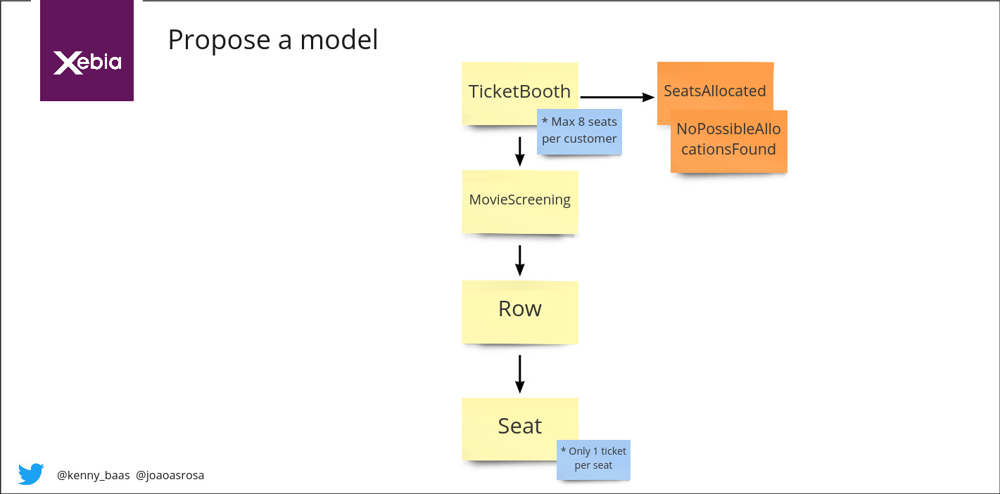

# Bestsellers DDD Workshop

## Requirements

Java 8 or higher
Maven
Lombok plugin

## Exercise

Start on main branch by implementing the tests `TicketBoothShould` by doing outside-in TDD. We already setup most scaffolding with an aenemic Domain Model to help you. You can find the stubs for the MovieScreening state at `Stubs/`. In Stubs you can create your own examples by following the json schema that is already there. It all comes down to the `showId` that is being used in the tests.

We use the following naive first design of our model to implement with outside-in TDD:

